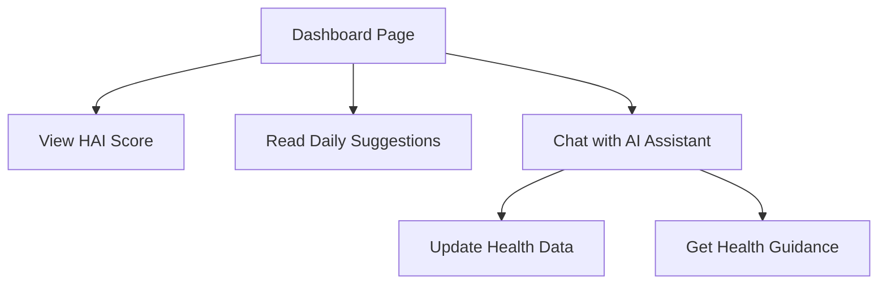

# RxMindr Blueprint - Product Requirements Document

## 1. Product Overview
RxMindr Blueprint is a modern, responsive health tracker web application that provides users with AI-powered health insights and personalized recommendations through an intuitive, futuristic interface.

The application serves as a comprehensive health dashboard where users can monitor their Health AI Index (HAI) score, receive daily AI-generated suggestions, and interact with an intelligent health assistant for data management and guidance.

Target market: Health-conscious individuals seeking data-driven insights and AI-powered health optimization tools.

## 2. Core Features

### 2.1 User Roles
| Role | Registration Method | Core Permissions |
|------|---------------------|------------------|
| Health User | Email registration | Can view HAI score, receive daily suggestions, chat with AI assistant |

### 2.2 Feature Module
Our RxMindr Blueprint application consists of the following main pages:
1. **Dashboard page**: user profile section, health AI index display, daily suggestions card, AI health assistant chat interface.

### 2.3 Page Details
| Page Name | Module Name | Feature description |
|-----------|-------------|---------------------|
| Dashboard page | Profile Section | Display circular profile picture, user name in bold, Health AI Index (HAI) score as progress indicator (1-100) |
| Dashboard page | Daily Suggestions Card | Show 3 AI-generated health suggestions in bullet format (e.g., "Walk 10,000 steps", "Eat 100g protein", "Sleep 8 hours") |
| Dashboard page | AI Health Assistant | Conversational chatbot interface with message bubbles (user right-aligned, AI left-aligned), input bar with send button for health data updates |

## 3. Core Process
User opens the dashboard and immediately sees their current HAI score and profile information. They can review their daily AI-generated health suggestions and interact with the AI Health Assistant to update health data, ask questions, or receive personalized guidance through natural conversation.

## 4. User Interface Design
### 4.1 Design Style
- Primary colors: Clean white background (#FFFFFF)
- Secondary colors: Blue/green health-tech accents (#3B82F6, #10B981)
- Button style: Rounded corners with soft shadows
- Font: Modern sans-serif (Inter font family)
- Layout style: Card-based design with rounded edges and subtle shadows
- Icon style: Clean, minimal health-tech icons with smooth transitions

### 4.2 Page Design Overview
| Page Name | Module Name | UI Elements |
|-----------|-------------|-------------|
| Dashboard page | Profile Section | Circular profile picture (64px), bold user name (text-xl), HAI score badge with progress indicator (blue/green gradient) |
| Dashboard page | Daily Suggestions Card | White card background, rounded-lg corners, shadow-md, bullet points with health icons, padding-6 |
| Dashboard page | AI Health Assistant | Chat container with message bubbles, user messages (bg-blue-500, text-white, rounded-r-lg), AI messages (bg-gray-100, rounded-l-lg), input bar with send button (bg-blue-500) |

### 4.3 Responsiveness
The application is designed mobile-first with responsive breakpoints for desktop adaptation. Touch interaction optimization is implemented for mobile devices with appropriate button sizes and gesture support.