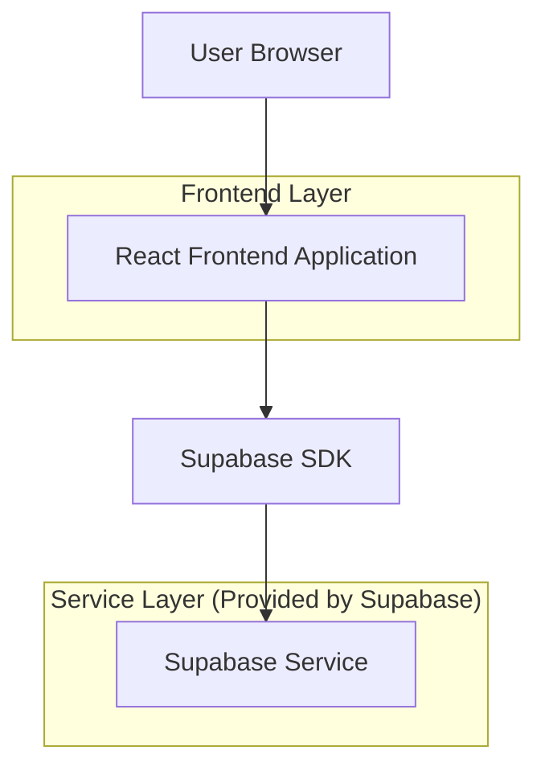
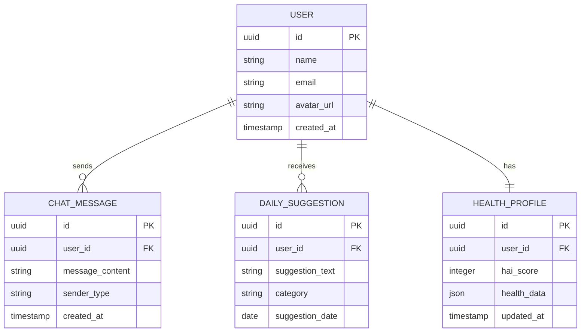

# RxMindr Blueprint - Technical Architecture Document

## 1. Architecture design



## 2. Technology Description
- Frontend: React@18 + TypeScript@5 + Tailwind CSS@3 + Vite
- Backend: Supabase

## 3. Route definitions
| Route | Purpose |
|-------|---------|
| / | Dashboard page, displays user profile, HAI score, daily suggestions, and AI chat interface |

## 4. API definitions
### 4.1 Core API

User profile data
```
GET /api/user/profile
```

Response:
| Param Name| Param Type  | Description |
|-----------|-------------|-------------|
| id        | string      | User unique identifier |
| name      | string      | User display name |
| avatar_url| string      | Profile picture URL |
| hai_score | number      | Health AI Index score (1-100) |

Daily suggestions
```
GET /api/suggestions/daily
```

Response:
| Param Name| Param Type  | Description |
|-----------|-------------|-------------|
| suggestions| array      | Array of 3 daily health suggestions |
| generated_at| string    | Timestamp of suggestion generation |

AI Chat interaction
```
POST /api/chat/message
```

Request:
| Param Name| Param Type  | isRequired  | Description |
|-----------|-------------|-------------|-------------|
| message   | string      | true        | User message content |
| user_id   | string      | true        | User identifier |

Response:
| Param Name| Param Type  | Description |
|-----------|-------------|-------------|
| response  | string      | AI assistant response |
| timestamp | string      | Message timestamp |

## 5. Data model

### 5.1 Data model definition


### 5.2 Data Definition Language
User Table (users)
```sql
-- create table
CREATE TABLE users (
    id UUID PRIMARY KEY DEFAULT gen_random_uuid(),
    name VARCHAR(100) NOT NULL,
    email VARCHAR(255) UNIQUE NOT NULL,
    avatar_url TEXT,
    created_at TIMESTAMP WITH TIME ZONE DEFAULT NOW(),
    updated_at TIMESTAMP WITH TIME ZONE DEFAULT NOW()
);

-- Health Profile Table
CREATE TABLE health_profiles (
    id UUID PRIMARY KEY DEFAULT gen_random_uuid(),
    user_id UUID NOT NULL,
    hai_score INTEGER CHECK (hai_score >= 1 AND hai_score <= 100),
    health_data JSONB,
    updated_at TIMESTAMP WITH TIME ZONE DEFAULT NOW()
);

-- Daily Suggestions Table
CREATE TABLE daily_suggestions (
    id UUID PRIMARY KEY DEFAULT gen_random_uuid(),
    user_id UUID NOT NULL,
    suggestion_text TEXT NOT NULL,
    category VARCHAR(50),
    suggestion_date DATE DEFAULT CURRENT_DATE,
    created_at TIMESTAMP WITH TIME ZONE DEFAULT NOW()
);

-- Chat Messages Table
CREATE TABLE chat_messages (
    id UUID PRIMARY KEY DEFAULT gen_random_uuid(),
    user_id UUID NOT NULL,
    message_content TEXT NOT NULL,
    sender_type VARCHAR(10) CHECK (sender_type IN ('user', 'ai')),
    created_at TIMESTAMP WITH TIME ZONE DEFAULT NOW()
);

-- create indexes
CREATE INDEX idx_health_profiles_user_id ON health_profiles(user_id);
CREATE INDEX idx_daily_suggestions_user_id ON daily_suggestions(user_id);
CREATE INDEX idx_daily_suggestions_date ON daily_suggestions(suggestion_date DESC);
CREATE INDEX idx_chat_messages_user_id ON chat_messages(user_id);
CREATE INDEX idx_chat_messages_created_at ON chat_messages(created_at DESC);

-- Grant permissions
GRANT SELECT ON users TO anon;
GRANT ALL PRIVILEGES ON users TO authenticated;
GRANT SELECT ON health_profiles TO anon;
GRANT ALL PRIVILEGES ON health_profiles TO authenticated;
GRANT SELECT ON daily_suggestions TO anon;
GRANT ALL PRIVILEGES ON daily_suggestions TO authenticated;
GRANT SELECT ON chat_messages TO anon;
GRANT ALL PRIVILEGES ON chat_messages TO authenticated;

-- init data
INSERT INTO users (name, email, avatar_url) VALUES 
('John Doe', 'john.doe@example.com', 'https://images.unsplash.com/photo-1472099645785-5658abf4ff4e?w=150&h=150&fit=crop&crop=face');

INSERT INTO health_profiles (user_id, hai_score, health_data) VALUES 
((SELECT id FROM users WHERE email = 'john.doe@example.com'), 78, '{"steps": 8500, "sleep_hours": 7.5, "water_intake": 2.1}');

INSERT INTO daily_suggestions (user_id, suggestion_text, category) VALUES 
((SELECT id FROM users WHERE email = 'john.doe@example.com'), 'Walk 10,000 steps today', 'exercise'),
((SELECT id FROM users WHERE email = 'john.doe@example.com'), 'Eat 100g protein', 'nutrition'),
((SELECT id FROM users WHERE email = 'john.doe@example.com'), 'Sleep 8 hours tonight', 'sleep');
```